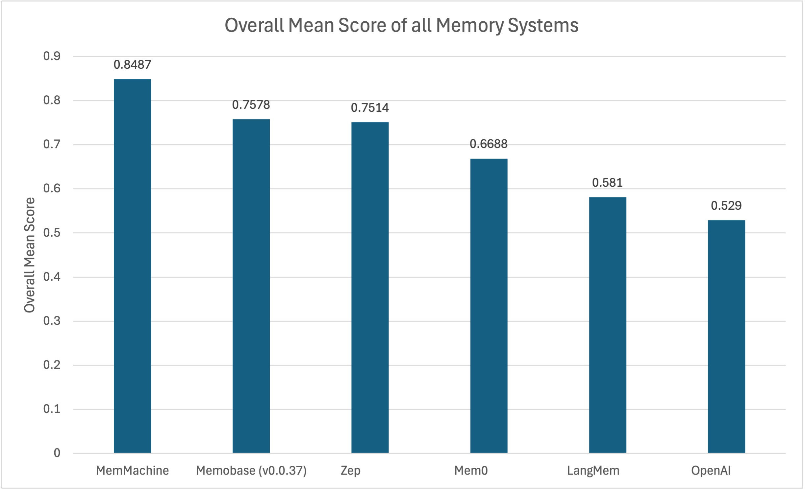
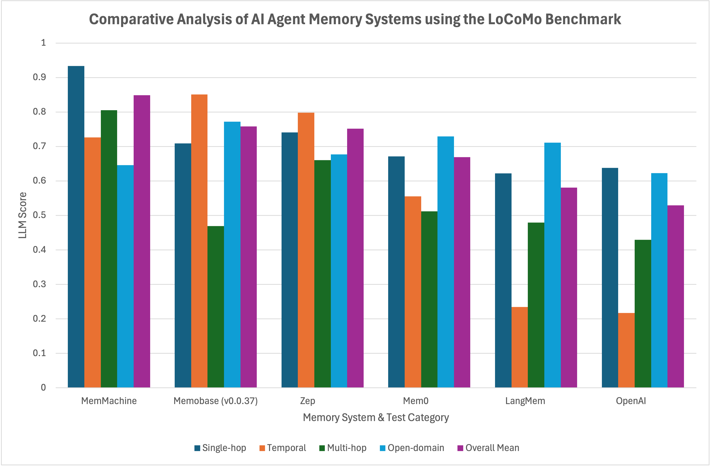

In their paper, "[Evaluating Very Long-Term Conversational Memory of LLM Agents](https://arxiv.org/abs/2402.17753)", Snap researchers introduced the open-source [LoCoMo benchmark](https://github.com/snap-research/LoCoMo). LoCoMo provides a new standard for evaluating the true long-term conversational memory of AI agents.

Unlike traditional LLM benchmarks, such as MMLU or SWE-Bench, that test a model's static knowledge, LoCoMo specifically targets an agent's ability to maintain and reason over extended conversational contexts. It is designed to go beyond simple recall—the ability to find a fact in a large block of text. Instead, it measures an agent's capacity to build, maintain, and reason over an evolving, multi-session memory, just as humans do.

## The LoCoMo Dataset

The dataset, a collection of conversations between different pairs of characters (e.g., "Audrey" and "Andrew"), unfolds over multiple sessions with specific dates and times. The true test lies in the variety of questions used to evaluate the model's performance on three primary tasks:

1. **Question Answering (QA):** This task directly examines an agent's ability to recall and reason over information from long conversations. Questions are categorized into four distinct reasoning types: single-hop (factual recall), temporal (identifying event timeframes), multi-hop (linking multiple pieces of information), and adversarial (questions designed to mislead).
2. **Event Summarization:** This task measures an agent's causal and temporal understanding by requiring it to summarize conversation history into an event graph.
3. **Multi-modal Dialogue Generation:** This assesses an agent's capacity to use relevant context from past conversations to generate consistent and coherent responses.

The dataset comprises a total of 1,986 questions, categorized to assess various aspects of an agent's memory and reasoning. For official scoring and evaluation, only the four core question categories (1-4) are processed.

| Category | Description | Total Questions |
| :--- | :--- | :--- |
| **1** | **Multi-Hop:** Questions that require synthesizing information from multiple sessions. | 282 |
| **2** | **Temporal Reasoning:** Questions can be answered through temporal reasoning and capturing time-related data cues within the conversation. | 321 |
| **3** | **Open-Domain:** Questions can be answered by integrating a speaker’s provided information with external knowledge, such as commonsense  or world facts. | 96 |
| **4** | **Single-Hop:** Questions asking for specific facts directly mentioned in the single session conversation.  | 841 |
| **5** | **Adversarial:** These questions are designed to trick the agent into providing wrong answers, with the expectation that the agent will correctly identify them as unanswerable. | 446 |
| **Total** | | **1986** |

You may notice that our Category IDs and Descriptions may not match LoCoMo benchmark results from other vendors. See [Appendix A](#appendix-a) for details.

The structure of these questions reveals the benchmark's true purpose: to go beyond simple memory. The factual and temporal questions serve as a baseline, while the Inference and Adversarial questions test a model's capacity for nuanced reasoning and robustness against hallucination.

The adversarial category of questions (Category 5) is designed to test a model's ability to identify questions that cannot be answered from the provided conversation history. This category is excluded from final scoring and evaluation because there is no official ground truth answer against which to grade, a common practice among researchers to ensure a fair and consistent comparison of results.

### The 'LLM Judge Score'

For simplicity and ease of comparison, our benchmark results are reported using a single, easy-to-digest score, referred to as the **LLM Judge Score** (`llm_score`). This score is derived by using a powerful language model, such as OpenAI's GPT-4o-mini, to act as a judge. The LLM judge compares the answer provided by the tested memory method to the ground truth and assigns a score of 1 if they are considered "the same," and 0 otherwise. A higher `llm_score` is considered better.

While the `llm_score` offers a quick and convenient way to compare models, it's important to remember that it is a proxy. A single number cannot fully capture the nuances of conversational quality, including fluency, tone, and overall user experience.

## Performance Analysis: MemMachine on the LoCoMo Benchmark

MemMachine's architecture is designed to address the challenges of long-term memory with two distinct memory types: **Episodic Memory** and **Profile Memory**. We present the initial results for our **Episodic Memory**, which refers to the ability to store and recall specific past experiences or events.

For our evaluation of LoCoMo, we allowed an agent to perform multiple memory searches to provide the best answer to the question.

The table below shows the performance of MemMachine's Episodic Memory on a key subset of the LoCoMo benchmark's question categories.

| Category | llm_score | count   | type |
| :-------- | :---------: | :-------: | :-----------: |
| 1        |    0.8050 |   282   |   multi_hop |
| 2        |    0.7259 |   321   |    temporal |
| 3        |    0.6458 |    96   | open_domain |
| 4        |    0.9334 |   841   |  single_hop |
| **Overall Mean Scores** | **0.8487** | **Total: 1540** | |

The overall mean score in the benchmark is calculated using a **weighted average**, where each category’s score is multiplied by the number of questions in that category, summed together, and then divided by the total number of questions. In this case:  

$$
\text{Overall Score} = \frac{(0.8050 \times 282) + (0.7259 \times 321) + (0.6458 \times 96) + (0.9334 \times 841)}{1540} = 0.8487
$$

This ensures that larger categories, like *single_hop* with 841 questions, have a bigger impact on the final overall score than smaller ones.

The results clearly demonstrate the strengths of the MemMachine Episodic Memory.

- **Single-hop (0.9334):** The highest score is in this category, showing an exceptional ability to retrieve individual facts from past conversations. This is a critical foundation for building reliable conversational agents.
- **Multi-hop (0.8050):** This score indicates that our Episodic Memory can successfully link related pieces of information from different parts of a conversation, allowing for more complex reasoning.
- **Temporal (0.7259):** A strong score here confirms that our system isn't just storing facts but also understanding their sequence and context over time, which is crucial for building a cohesive conversational history.
- **Open-domain (0.6458):** This memory type is optimized for user-centric information. The score here is strong, demonstrating our system's ability to not only recall facts but also provide context-aware responses.

With an impressive overall `llm_score` of **0.8487**, these results validate MemMachine's Episodic Memory as a highly effective solution for creating and utilizing rich chat sessions.

A Note on Our Testing Environment: The benchmark tests for MemMachine's Episodic Memory were performed on a MacBook Pro 14-inch (November 2023 model) with an Apple M3 Pro (11-core) chip and 18 GB of RAM. The LLM models, gpt-4o-mini and text-embedding-3-small, used for these tests were run via the OpenAI API.

## Comparative Analysis

MemMachine's performance on the LoCoMo benchmark demonstrates a clear strategic advantage in a crowded field of AI agent memory solutions. By directly comparing our results to those of other publicly published scores, we can articulate MemMachine's unique strengths and market position. We source most of the results from [Memobase](https://github.com/memodb-io/memobase/tree/main/docs/experiments/locomo-benchmark), and the [Zep](https://github.com/getzep/zep-papers/tree/main/kg_architecture_agent_memory/locomo_eval) results are sourced directly. The table below presents those publicly published LoCoMo results from various systems, compared with MemMachine.

| **System** | **Single-hop** | **Temporal** | **Multi-hop** | **Open-domain** | **Overall Mean Score** |
| :--- | :--- | :--- | :--- | :--- | :--- |
| **MemMachine** | **0.9334** | **0.7259** | **0.8050** | **0.6458** | **0.8487** |
| Memobase (v0.0.37) | 0.7092 | 0.8505 | 0.4688 | 0.7717 | 0.7578 |
| Zep | 0.7411 | 0.7979 | 0.6604 | 0.6771 | 0.7514 |
| Mem0 | 0.6713 | 0.5551 | 0.5115 | 0.7293 | 0.6688 |
| LangMem | 0.6223 | 0.2343 | 0.4792 | 0.7112 | 0.5810 |
| OpenAI | 0.6379 | 0.2171 | 0.4292 | 0.6229 | 0.5290 |

As noted above, the individual category results from other benchmarks may be miscategorized, but the overall results are a reliable indicator.

Comparing the Overall Mean Score across the results is shown in the following chart, clearly showing MemMachine taking the top spot (higher is better).

Our performance on the LoCoMo benchmark positions MemMachine at the forefront of the competitive landscape. With an overall score of **0.8487**, MemMachine demonstrably outperforms many of the most-cited systems, including Mem0, Zep, and Memobase. This result validates our architectural choices, proving that a well-structured Episodic Memory system yields superior results.

The following chart visualizes the category results.

MemMachine is the new benchmark for production-grade AI agent memory. We provide the foundational accuracy and a high-performance system required for building robust, reliable, and intelligent agents for a wide array of applications. For developers and enterprises seeking a memory solution that just works and works exceptionally well, MemMachine stands as the new industry leader.

## Conclusion

The LoCoMo benchmark has established a new standard for evaluating AI agent memory, and our results prove that a new leader has emerged. While early solutions like Memobase and Mem0 set the stage for innovation, MemMachine has shown that a refined, production-ready system can achieve superior performance. We believe the agent of the future will need a memory far more sophisticated than today's, and our top-tier performance on LoCoMo is a powerful validation of our approach.

Our philosophy is simple: we're not just trying to win at a benchmark; we're striving to build a memory solution that functions like a human brain, with comprehensive recall and context that endures over time. Our success on the LoCoMo benchmark proves that this approach is not only viable, but it's the best way forward.

If our vision for a more intelligent and reliable agent resonates with you, we'd love for you to try it, tweak it, or challenge it.

- [Explore the code on GitHub](https://github.com/MemMachine/MemMachine)
- Try it live in our [Playground](https://memmachine.ai/playground)
- Check out our [website,](https://memmachine.ai) where you'll find use cases, examples, and more.
- Join the conversation on our [Discord Server](https://discord.gg/usydANvKqD). Ask questions, share your projects, and connect with other developers.

### Appendix A

When comparing LoCoMo benchmark results from various sources, you might notice discrepancies in how categories are reported. We want to clarify our approach and the reason behind it.

Section 4.1 of the [LoCoMo paper](https://arxiv.org/pdf/2402.17753) describes the five distinct reasoning categories for the Question Answering task. The paper presents them in a numbered list:

> "For a comprehensive assessment of this memory, we introduce a question-answering task divided into five distinct reasoning categories: (1) Single-hop questions require answers based on a single session; (2) Multi-hop questions require synthesizing information from multiple different sessions; (3) Temporal reasoning questions can be answered through temporal reasoning and capturing time-related data cues within the conversation; (4) Open-domain knowledge questions can be answered by integrating a speaker’s provided information with external knowledge such as commonsense or world facts; (5) Adversarial questions are designed to trick the agent into providing wrong answers, with the expectation that the agent will correctly identify them as unanswerable."

This numbered list in the paper can be interpreted in two ways:

- **As a strict, fixed mapping:** Where `(1)` always corresponds to Category ID 1, `(2)` to Category ID 2, and so on.
- **As an enumerative list:** Simply describing five categories, without implying that `(1)` specifically maps to the numerical ID '1' in the dataset, `(2)` to '2', etc.

Upon closer inspection of the [LoCoMo source code](https://github.com/snap-research/locomo/blob/main/task_eval/evaluation.py#L189) and the `locomo10.json` dataset, it becomes clear that the second interpretation is correct. The numerical IDs (`category: 1`, `category: 2`, etc.) in the dataset **do not** directly align with the sequential order in which they are presented in the paper's text. Instead, the dataset and evaluation code assign these IDs to different category types.

This finding suggests that some public LoCoMo results might be presenting misclassified data, making a direct and fair comparison challenging. For clarity, the table below shows the categorical assignment as described in the White Paper versus the actual assignment found in the source code (which we consider the definitive "truth" for our evaluations).

| Category ID (JSON/Code) | White Paper (sequential description) | Source Code (actual mapping) |
| :------- | :---------- | :---------- |
| 1 | Single-hop | Multi-Hop |
| 2 | Multi-Hop | Temporal Reasoning |
| 3 | Temporal Reasoning | Open-Domain |
| 4 | Open-Domain | Single-Hop |
| 5 | Adversarial | Adversarial |
