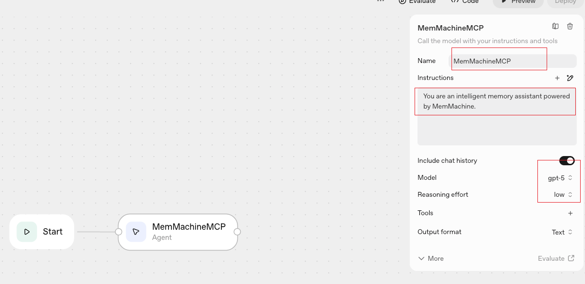
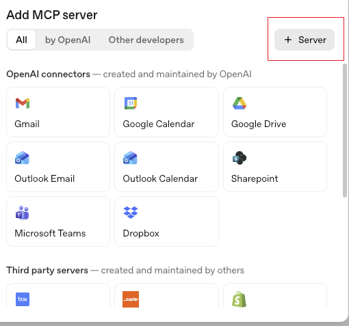
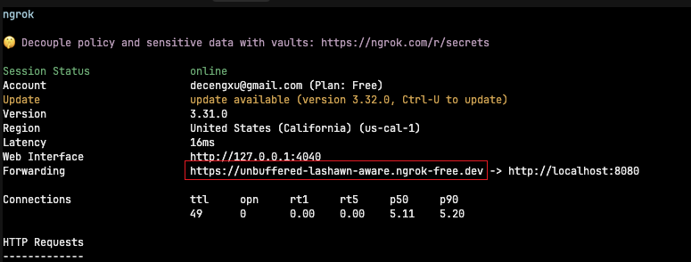
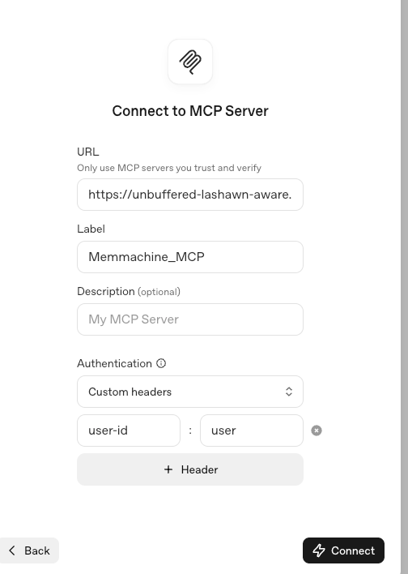
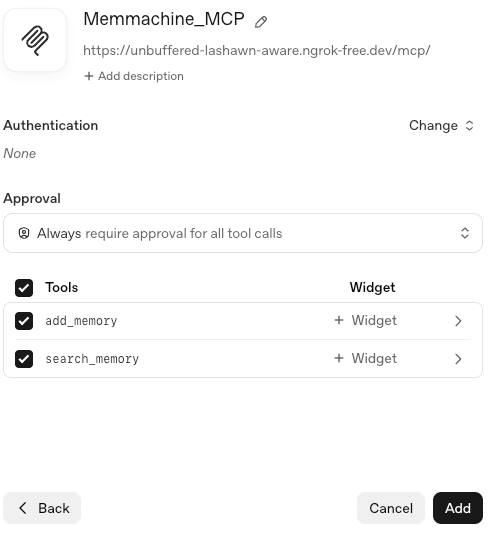

Integrating OpenAI Agent Builder with the MemMachine MCP server allows your AI agents to store and recall information, effectively giving them memory.

The setup connects your locally hosted MemMachine MCP endpoint with OpenAI’s cloud-based Agent Builder workflow system.

## Prerequisites

Before you begin, ensure the following are ready:

- MemMachine MCP HTTP server running and accessible in a local or remote environment on port 8080 (default).
- OpenAI account with access to Agent Builder.
- ngrok or similar tool to expose your local MCP server to the internet.

## Step 1: Start the MemMachine MCP Server

Start your MCP HTTP server with:

```bash
export MEMORY_CONFIG=/path/to/configuration.yml
uv run python -m memmachine.server.mcp_http --host 0.0.0.0 --port 8080
```

Ensure the server is running and accessible.

## Step 2: Open the OpenAI Agent Builder

In your browser, navigate to the OpenAI Agent Builder at https://platform.openai.com/agent-builder. Create a new workflow or open an existing one.


## Step 3: Configure MCP Endpoint in Agent Builder

On the workflow canvas, you’ll see a Start node and a default agent block.
Configure it as follows:

- Name: MemMachineMCP
- Instructions: You are an intelligent memory assistant powered by MemMachine
- Model: gpt-5
- Reasoning Effort: Low
- Include Chat History: Enabled



## Step 4: Add MCP Memory Tools

Click '+' next to the agent block to add tools. Search for "MCP" and add the following tools:


Then click "+ Server" to add your own connection.



## Step 5: Configure MCP Server Connection

Run this command if you haven’t started ngrok yet:

```bash
ngrok http 8080
```

This command will create a secure tunnel to your local MCP server, providing you with a public URL.



> Important: Ensure your ngrok URL includes the /mcp/ suffix, for example: `https://abc123.ngrok-free.dev/mcp/`

You’ll now see a form titled “Connect to MCP Server”. Fill it out as follows:

- MCP Endpoint URL: `https://your-ngrok-url.ngrok-free.dev/mcp/`
- Label: Memmachine_MCP
- Authentication Type: Custom Headers
- Custom Headers:
  - Key: user-id
  - Value: user

Click "Connect" to save the configuration.

> Note: This `user-id` header is used by MemMachine MCP to associate memory operations (add/search) with a specific user.



## Step 6: Approve Tools and Add Server

After connecting, approve the MCP tools to use the newly added server.

- add_memory → Memmachine_MCP
- search_memory → Memmachine_MCP

Select "Always require approval for all tool calls", then click "Add".



## Step 7: Test the Integration

Once your MemMachine MCP server is added, it will appear under “Tools” for your agent.

Try these example interactions in the Preview panel:

### Add Memory

In the chat input, type:

```text
I recently bought AirPods Pro 3.
```

### Search Memory

Then ask:

```text
What did I buy recently?
```

You should see the agent successfully storing and retrieving information via the MemMachine MCP server.

## Conclusion

By integrating OpenAI Agent Builder with MemMachine MCP, you empower your AI agents with persistent memory capabilities. This setup allows agents to remember past interactions, enhancing their usefulness and user experience.

## Recommendations

- User ID Consistency: Use consistent user IDs across different sessions to maintain memory continuity.
  - Why this matters: Keeping a consistent user ID ensures that your memory context stays linked across clients such as Claude Desktop and OpenAI Agent Builder.
- ngrok: For production use, consider deploying your MCP server on a stable hosting solution rather than relying on ngrok for long-term accessibility.
- Authentication: Use "Custom Headers" for authentication to easily manage user identities. In the future, OAuth support will be added for enhanced security.
