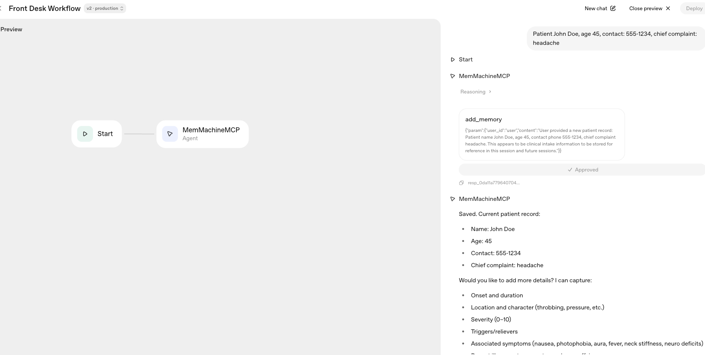
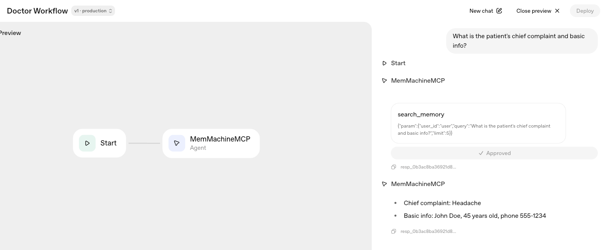
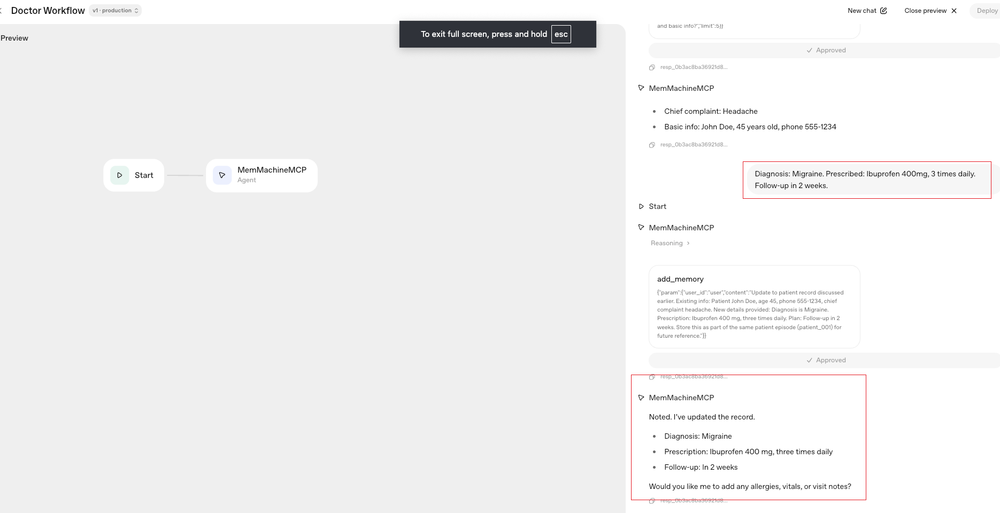
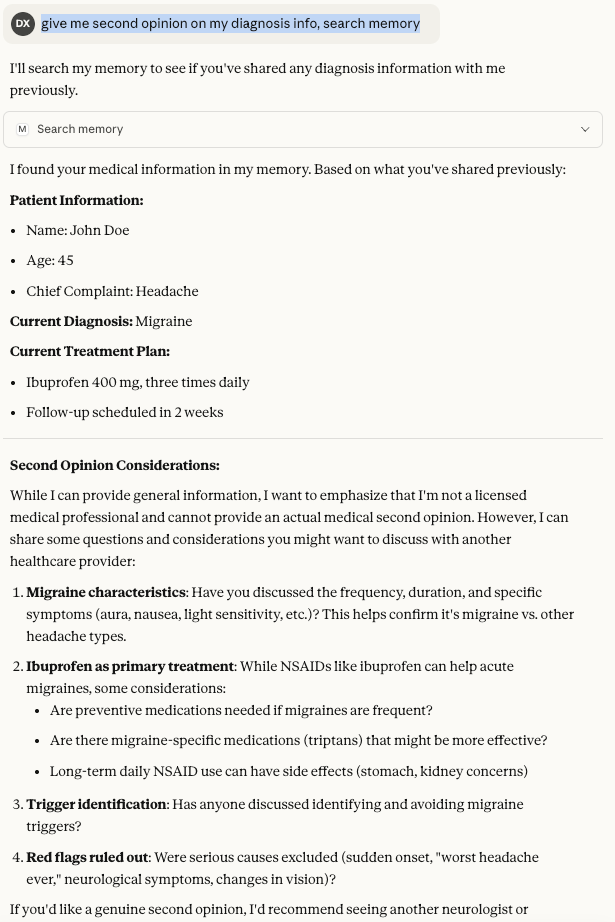

AI agents are getting smarter, but there's a critical challenge: how do you enable different agents across different platforms to share the same memory? What if your OpenAI workflow, Claude Desktop assistant, and custom agents could all access the same user context seamlessly?
Working with Cedric Zhuang from the MemMachine engineering team, we've built a solution that does exactly that—using the Model Context Protocol (MCP) as a universal memory backend.

## The Challenge: Memory Silos

Most AI implementations today suffer from memory fragmentation. Your ChatGPT conversation knows one thing, your Claude assistant knows another, and your custom workflow remembers something entirely different. This creates frustration for users who expect AI to remember context across platforms.

The solution? A shared memory layer that multiple agents can read from and write to, regardless of which platform they're running on.

## Enter MemMachine MCP

MemMachine's MCP implementation acts as a universal memory Resource Server that any MCP-compatible client can connect to. By using a consistent MM_USER_ID (user identifier), different agents can access the same memory context, creating a truly unified AI experience.

In a [previous blog post](/blog/2025/11/integrating-openai-agent-builder-with-memmachine-mcp-server/), we demonstrated how to integrate OpenAI Agent Builder with MemMachine MCP. Now, let's explore how multiple AI platforms can share memory through MCP.

### How It Works: A Hospital Demo

To demonstrate this capability, we built a simple hospital scenario with three distinct interactions:

1. Front Desk Workflow (OpenAI Agent Builder)
    The Front Desk Agent registers a new patient named John Doe, age 45, with contact 555-1234 and a chief complaint of headache. This information is stored using the add_memory tool with user ID patient-001.

    ```text
    Prompt: Patient John Doe, age 45, contact: 555-1234, chief complaint: headache
    ```

    

2. Doctor Workflow (OpenAI Agent Builder)
    The Doctor Agent retrieves the patient's information using search_memory

    ```text
    Prompt: What is the patient’s chief complaint and basic info?
    ```

    

    The doctor diagnoses them with a migraine, prescribes Ibuprofen 400mg three times daily, and schedules a follow-up in 2 weeks. All updates are saved back to the shared memory using the same patient-001 identifier.

    ```text
    Diagnosis: Migraine  
    Prescription: Ibuprofen 400mg, three times daily  
    Follow-up: In 2 weeks
    ```

    

3. Patient Query (Claude Desktop)
    Later, the patient opens Claude Desktop and asks for a second opinion. Because Claude is configured with the same MM_USER_ID (patient-001), it instantly retrieves the complete medical record—including the original complaint, diagnosis, and prescription—all through the same MCP endpoint.

    

## The Key: Consistent User Identity

The magic happens through the user-id header. Every client—whether it's OpenAI Agent Builder, Claude Desktop, or a custom application—uses the same user identifier when connecting to the MemMachine MCP server. This ensures that memory operations (add/search) are consistently associated with the right user context.

## Setting Up the Integration

### Prerequisites

- MemMachine MCP HTTP server running locally or remotely on port 8080
- ngrok to expose your local endpoint to the internet
- Access to OpenAI Agent Builder or Claude Desktop

### Quick Start

1. Start your MCP server:

    ```bash
    export MEMORY_CONFIG=/path/to/configuration.yml
    uv run python -m memmachine.server.mcp_http --host 0.0.0.0 --port 8080
    ```

2. Expose it via ngrok:

   ```bash
   ngrok http 8080
   ```

3. Connect your AI platform to the MCP endpoint at `https://your-ngrok-url.ngrok-free.dev/mcp/`
4. Configure custom headers with `user-id: <your-user-id>`

### Available Tools

- `add_memory`: Store new information to the user's profile
- `search_memory`: Retrieve relevant memories based on queries

## Why This Matters

This implementation proves that MemMachine MCP can serve as a universal memory backend across different AI platforms. The implications are significant:

- **Consistent User Experience**: Users get personalized interactions regardless of which AI platform they're using
- **Simplified Development**: Developers can build multi-agent systems without worrying about memory fragmentation
- **Scalability**: Easily add more AI platforms to the ecosystem by simply connecting them to the MCP server.
