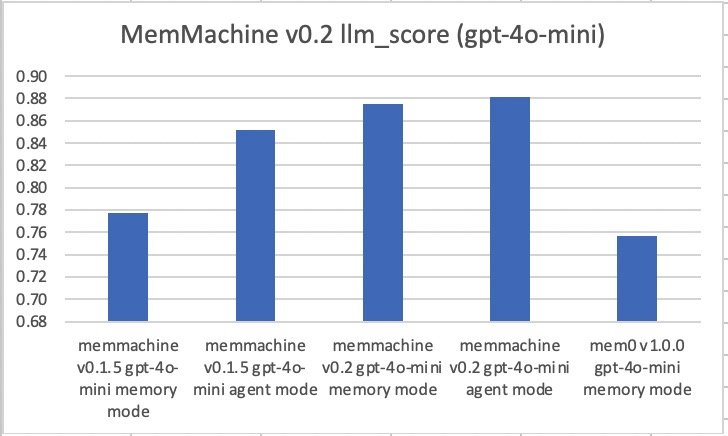
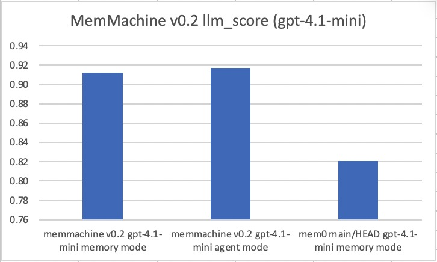
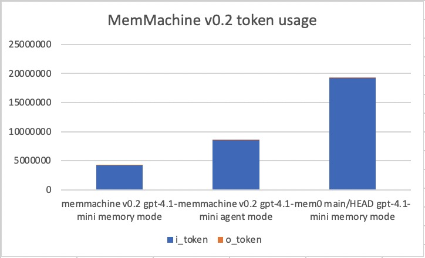
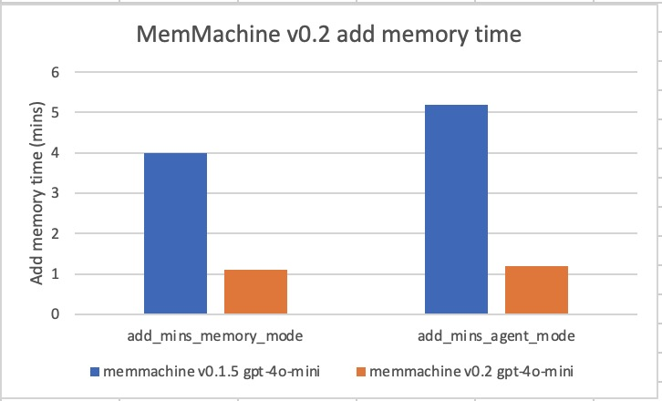
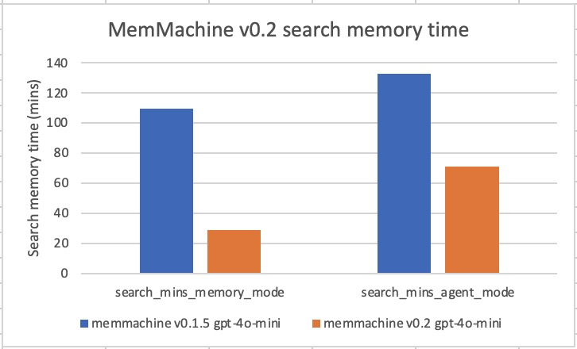

# MemMachine v0.2 release - Locomo benchmark results

## Introduction

This paper presents the results of the Mem0 evaluation of Locomo benchmark for the v0.2 release of memMachine.  This new release delivers significant improvements over the previous release v0.1.5 in many aspects of the memory system.

The test environment is setup as follows.

### Eval-LLM

The eval-LLM is the chat LLM that is used to answer the questions in the Locomo benchmark.  The choice of eval-LLM can significantly influence the resulting score.  The Mem0 evaluation of Locomo benchmark historically uses the OpenAI gpt-4o-mini as the eval-LLM.  To compare different products, the eval-LLM will be the same for all products under test.

Since the original Mem0 evaluation of Locomo benchmark was published, the newer OpenAI gpt-4.1-mini LLM was introduced.  In this paper, we also do a comparison between the original gpt-4o-mini and the newer gpt-4.1-mini when used as the eval-LLM.

### Vector DB embedder

When using a memory system, the embedder is the essential element that is used to index the memories in a chat history.  The embedder facilitates the retrieval of saved memories to correctly and factually answer questions.  The choice of embedder can significantly influence the quality of the answers provided by the memory system.  The Mem0 evaluation of Locomo benchmark historically uses the OpenAI text-embedding-3-small embedder.  To compare different products, the embedder will be the same for all products under test.

### Judge-LLM

The judge-LLM is the chat LLM that is used to judge if the response from the eval-LLM correctly answers the question in the Locomo benchmark.

The choice of judge-LLM can significantly influence the resulting score.  Different LLMs may give false positives or false negatives when judging the same response.  The Mem0 evaluation of Locomo benchmark historically uses the OpenAI gpt-4o-mini as the judge-LLM.  To compare different products, the judge-LLM will be the same for all products under test.

### Reranker

When using a memory system, the reranker is an element that is used to re-evaluate the best matching memories that were retrieved by the embedder.  The reranker will re-sort the retrieved results moving the best results to the top.  The reranker provides a second level of evaluation, providing the best set of saved memories to correctly and factually answer questions.  The choice of reranker can significantly influence the quality of the answers provided by the memory system.  The MemMachine v0.2 uses the AWS cohere.rerank-v3-5:0 as the reranker for the Locomo benchmark.

### Question categories

The original Locomo benchmark has 5 categories of questions.  The Mem0 evaluation of Locomo benchmark uses questions from 4 of the 5 categories.  The categories used are as follows:

| Category number | Description | Total Questions |
| --------------- | ----------- | --------------- |
| **1** | **Single-Hop:** Questions asking for specific facts directly mentioned in the single session conversation. | 282 |
| **2** | **Temporal Reasoning:** Questions can be answered through temporal reasoning and capturing time-related data cues within the conversation. | 321 |
| **3** | **Multi-Hop:** Questions that require synthesizing information from multiple sessions. | 96 |
| **4** | **Open-Domain:** Questions can be answered by integrating a speaker’s provided information with external knowledge, such as commonsense or world facts. | 841 |

### LLM-score

The judge-LLM will evaluate each question from the categories, and for each question the eval-LLM response is compared to the golden answer.  The judge-LLM assigns a llm-score of 1 if the answers are equal, and 0 otherwise.  The llm-score is tabulated for each question category.  Then the weighted mean is calculated to give an overall mean llm-score.

### Memory and agent modes

The MemMachine works in either memory mode or agent mode.  In memory mode, the MemMachine directly provides the context for a question being asked.  There is a single request to the eval-LLM for each question.  In agent mode, the MemMachine is presented as an OpenAI-agent to the eval-LLM.  When a question is given to the eval-LLM, the eval-LLM will use the MemMachine agent as a tool to retrieve the context for the question.  The eval-LLM may perform several rounds of requests to the MemMachine agent to formulate the best response.

## LLM-score results

Here are the observed llm-scores for MemMachine v0.2.

### LLM-score using gpt-4o-mini

The eval-LLM is gpt-4o-mini to compare against other memory products.

#### Memory mode (gpt-4o-mini)

Mean score per category

| Locomo category | bleu-score | f1-score | llm-score | count |
| 1.single hop | 0.1407 | 0.1993 | 0.8759 | 282 |
| 2.temporal | 0.0977 | 0.1847 | 0.7352 | 321 |
| 3.multi hop | 0.0871 | 0.1191 | 0.7083 | 96 |
| 4.open domain | 0.1436 | 0.2519 | 0.9465 | 841 |

Overall mean score

| bleu-score | 0.1300 |
| f1-score | 0.2200 |
| llm-score | 0.8747 |

#### Agent mode (gpt-4o-mini)

Mean score per category

| Locomo category | bleu-score | f1-score | llm-score | count |
| 1.single hop | 0.1147 | 0.1684 | 0.8404 | 282 |
| 2.temporal | 0.1402 | 0.2242 | 0.8069 | 321 |
| 3.multi hop | 0.0666 | 0.1037 | 0.7396 | 96 |
| 4.open domain | 0.1415 | 0.2508 | 0.9394 | 841 |

Overall mean score

| bleu-score | 0.1316 |
| f1-score | 0.2210 |
| llm-score | 0.8812 |

### LLM-score using gpt-4.1-mini

The newer gpt-4.1-mini provides better results than the previous LLM.  Here are the observed llm-scores for MemMachine v0.2 when the eval-LLM is gpt-4.1-mini.  We also re-ran the Mem0 memory system using gpt-4.1-mini for comparison.

#### Memory mode (gpt-4.1-mini)

Mean score per category

| Locomo category | bleu-score | f1-score | llm-score | count |
| 1.single hop | 0.1795 | 0.2497 | 0.8972 | 282 |
| 2.temporal | 0.1521 | 0.2549 | 0.8910 | 321 |
| 3.multi hop | 0.1059 | 0.1429 | 0.7500 | 96 |
| 4.open domain | 0.1868 | 0.3127 | 0.9441 | 841 |

Overall mean score

| bleu-score | 0.1732 |
| f1-score | 0.2785 |
| llm-score | 0.9123 |

#### Agent mode (gpt-4.1-mini)

Mean score per category

| Locomo category | bleu-score | f1-score | llm-score | count |
| 1.single hop | 0.1460 | 0.2125 | 0.8830 | 282 |
| 2.temporal | 0.1363 | 0.2366 | 0.9159 | 321 |
| 3.multi hop | 0.0744 | 0.1167 | 0.7188 | 96 |
| 4.open domain | 0.1613 | 0.2836 | 0.9512 | 841 |

Overall mean score

| bleu-score | 0.1479 |
| f1-score | 0.2503 |
| llm-score | 0.9169 |

## Token usage results

When using a memory system, the retrieved memories are added to the question when presented to the eval-LLM.  The amount of context generated by the memory system will add to the input token usage (e.g. prompt token usage).  The final prompt will also influence the amount of output tokens that the eval-LLM will emit.

Here are the observed token usage by MemMachine when in memory mode and in agent mode.  The Mem0 token usage is shown for comparison.

| memory system | i_token | o_token |
| memmachine v0.2 gpt-4.1-mini memory mode | 4199096 | 43169 |
| memmachine v0.2 gpt-4.1-mini agent mode | 8571936 | 93210 |
| mem0 main/HEAD gpt-4.1-mini memory mode | 19206707 | 14840 |

## Search time results

The MemMachine v0.2 release has many new optimizations to the handling of episodic memory.  Both the add and search memory times are significantly improved.

There is approximately 75% reduction in add memory time compared to previous release.

There is up to 75% reduction in search memory time compared to previous release.

## Conclusion

The new MemMachine v0.2 provides significant improvements over previous release, and is one of the highest scoring memory systems in the market.

