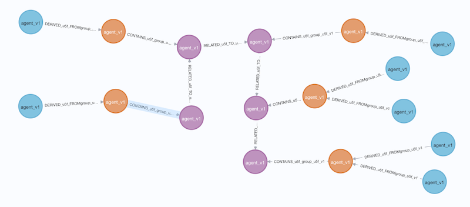
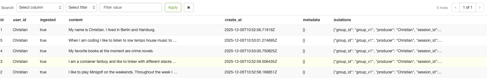
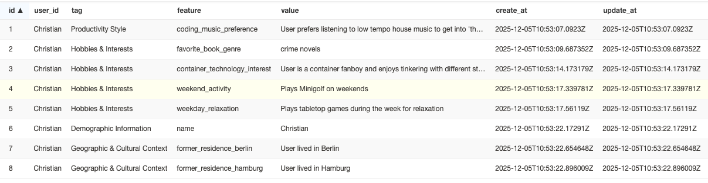
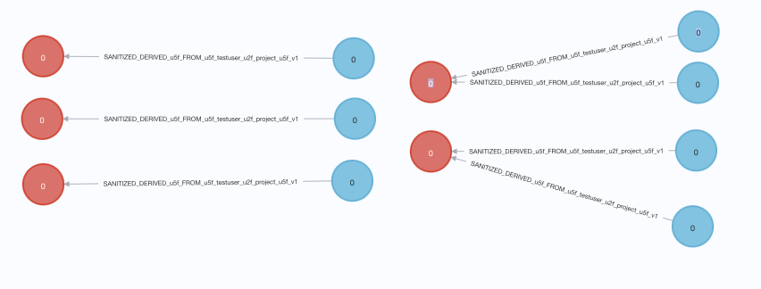
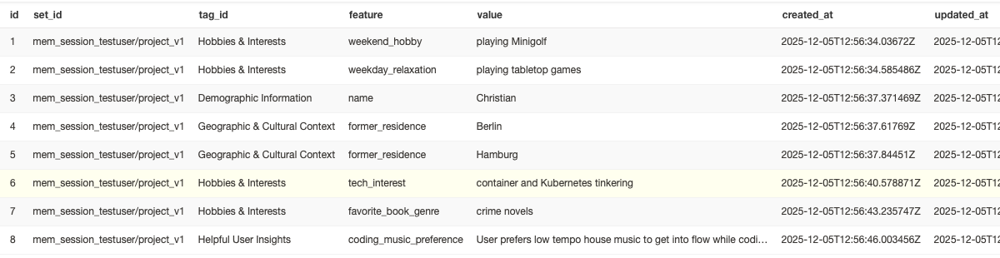

This blog article is going to walk you through the evolution of the RESTful API from v1 to v2, how they differ and what they have in common.  
You'll see that we did some incremental improvements in how we organize sessions and the response structure.

One major change to keep mind for Developers is that you need to create a project before you can store memories; before you were just shooting from the hip. 

## v1 Flow

Within the v1 API we organized the memories around sessions. When you added a memory you defined the following entities to capture important metadata around the message.  
Let's use the following minimalistic request body towards `POST /v1/memories` as an example:
```json
{
  "session": {
    "group_id": "group_v1",
    "user_id": [
      "Christian",
      "agent_v1"
    ],
    "session_id": "s-f62f517cf5fb997e97fa16"
  },
  "producer": "Christian",
  "produced_for": "agent_v1",
  "episode_content": "My name is Christian. I lived in Berlin and Hamburg.",
  "episode_type": "message",
  "metadata": {}
}
```

The `session_id` identified a collection of connected messages. E.g. to indicate they where part of the same conversation.  
All subsequent memories send with the same `session_id` were associated with the same conversation.

Let's kick of the conversation by sending the following messages with the same `"session"` content to MemMachine v1.

* My name is Christian. I lived in Berlin and Hamburg.
* I like to play Minigolf on the weekends. Throughout the week I relax by playing tabletop games.
* I am a container fanboy and like to tinker with different stacks on Kuberentes to keep me up to date.
* My favorite books at the moment are crime novels.
* When I am coding I like to listen to low tempo house music to get into 'the flow'.

Once send we can query Neo4j to see how they are represented (CYPHER query: `MATCH (n) RETURN *`).



As you can see all messages are neatly aligned. The nodes are organizes as follows:

1. `Episodes` (purple): capture the complete content of the memory. 
2. `Derivatives` (blue):  Chunk up individual sentences and prepare for LLM consumption by storing the embedding and prefix them with timestamp and producer.
2. `EpisodeCluster` (orange): cluster `Derivates` (in case the Episode was rather long)

The messages are also captured within a Pgvector (Postgres extension to store vector data) instance.



### Feature Extraction

So far, so expected. MemMachine also extracts information from the `Derivatives` above and stores them in Profile Memory in the pgvector table `prof`:



You can query both memory types using the RESTful API:

<table>
<tr>
<td width="50%" valign="top">

**Query**

```json
{
    "session": {
        "user_id": [
            "Christian"
        ],
        "group_id": "group_v1",
        "session_id": "s-f62f517cf5fb997e97fa16"
    },
    "query": "What's up with Berlin?",
    "filter": {},
    "limit": 10
}
```

</td>
<td width="50%" valign="top">

**Response**

```json
{
  "status": 0,
  "content": {
    "episodic_memory": [
      [],[],[""]
    ],
    "profile_memory": []
  }
}
```

</td>
</tr>
</table>

The reponse is split into `episodic_memory` which represents the actuall messages and `profile_memory` with extracted features.

<table>
<tr>
<td width="50%" valign="top">

**Episodic**

```json
[
    {
        "uuid": "945c20e1-777c-485f-9c72-cedfe57a1a78",
        "episode_type": "message",
        "content_type": "string",
        "content": "My name is Christian. I lived in Berlin and Hamburg.",
        "timestamp": "2025-12-05T10:52:54.144171",
        "group_id": "group_v1",
        "session_id": "s-f62f517cf5fb997e97fa16",
        "producer_id": "Christian",
        "produced_for_id": "agent_v1",
        "user_metadata": {}
    },
    {*episode2*},...
],[],[""]
```

The two other lists in the episodic memory are unused. They where meant to represent short term memory and a summary (which we'll encounter in v2).

</td>
<td width="50%" valign="top">

**Profile**

```json
[
      {
        "tag": "Geographic & Cultural Context",
        "feature": "former_residence_berlin",
        "value": "User lived in Berlin",
        "metadata": {
          "id": 7,
          "similarity_score": 0.578307032585144
        }
      },
      {
        "tag": "Geographic & Cultural Context",
        "feature": "former_residence_hamburg",
        "value": "User lived in Hamburg",
        "metadata": {
          "id": 8,
          "similarity_score": 0.3573840260505676
        }
      }
]
```

</td>
</tr>
</table>

As you can see within the profile memory it is scored on how similar it is to the query (`What's up with Berlin?`). 

## v2 Flow

The new API version has a similar workflow with one big destinction. It introduces projects and removes the implicit grouping via `session_id` when storing a message.

### Projects

To group messages we're going to create a project (`POST /api/v2/projects`):

<table>
<tr>
<td width="50%" valign="top">

**Query**

```json
{
  "org_id": "testuser",
  "project_id": "project_v1",
  "description": "This is a test project",
  "config": {
    "reranker": "my_reranker_id",
    "embedder": "openai_embedder"
  }
}
```

</td>
<td width="50%" valign="top">

**Response**

```json
{
  "org_id": "testuser",
  "project_id": "project_v1",
  "description": "This is a test project",
  "config": {
    "reranker": "my_reranker_id",
    "embedder": "openai_embedder"
  }
}
```

</td>
</tr>
</table>

Listing a project serves the current projects (`POST /api/v2/projects/list`).

```json
[
  {
    "org_id": "testuser",
    "project_id": "project_v1"
  }
]
```

### Add Memories

Now that we have a project, we can add the same memories than above.

```
{
  "org_id": "testuser",
  "project_id": "project_v1",
  "messages": [
    {
      "content": "My name is Christian. I lived in Berlin and Hamburg.",
      "producer": "Christian",
      "produced_for": "agent",
      "role": "user"
    }
  ]
}
```

In v2 the `EpisodeCluster` node was removed and episodes are not connected anymore.



The representation in Postgres shows the episodes...


... and the extracted features.



### Search Memories

Searching for memories has improved in terms of how the query is structured and what the response is.

<table>
<tr>
<td width="50%" valign="top">

**Query**


```json
{
    "org_id": "testuser",
    "project_id": "project_v1",
    "top_k": 10,
    "query": "",
    "filter": "",
    "types": ["episodic","semantic"]
}
```

</td>
<td width="50%" valign="top">

**Response**

```json
{
  "status": 0,
  "content": {
    "episodic_memory": {
      "long_term_memory": {"episodes": []},
      "short_term_memory": {
            "episodes": [],
            "episode_summary": [""]
        }
    },
    "semantic_memory": []
  }
}
```

</td>
</tr>
</table>

Slightly different from before, but more structed.

Short term and long term memory comprises of complete episodes. Short term more recent and long term provides the history.

```json
{
  "short_term_memory": {
    "episodes": [
        {
        "content": "I like to play Minigolf on the weekends. Throughout the week I relax by playing tabletop games.",
        "producer_id": "Christian",
        "producer_role": "user",
        "produced_for_id": "agent",
        "episode_type": "message",
        "metadata": null,
        "created_at": "2025-12-05T12:56:26.397757Z",
        "uid": "1"
        }
    ],
     "episode_summary": [""]
  }
}
```

The `episode_summary` is currently not filled, but will (as the name suggest) recap what happened recently.

#### Semantic Memory

Semantic memory returns extracted features of the profile.

```json
{
  "semantic_memory": [
    {
    "set_id": "mem_session_testuser/project_v1",
    "category": "profile",
    "tag": "Demographic Information",
    "feature_name": "name",
    "value": "Christian",
    "metadata": {
        "citations": null,
        "id": "3",
        "other": null
    }
  }
}
```

## Conclusion

Now that we saw the API in v1 and v2 after another we clearly see a refinement of the response. The key takeways are:

1. Before the episodic memory was a list and not explicitly chunked up - now the reponse has named keys.
2. The introduction of projects allows for a more fine grained control of which configurations to use on a project basis so that different projects can use different setups. In v1 the config choice made when the MemMachine instance was installed was used for all projects.
3. The configuration file of MemMachine was restructred for v2 so that it's more intuitive (which I did not show in this blog post, it's going to be a follow up about DevOps :) )

Please feel free to reach out to us on [Discord](https://discord.gg/usydANvKqD) or via issues on the [github](https://github.com/MemMachine/MemMachine). We'd love to hear back from you on how we can futher improve the MemMachine project in 2026.