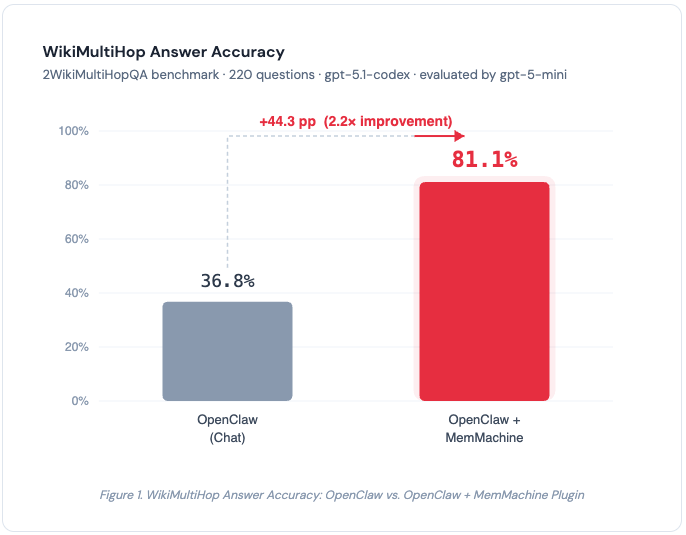
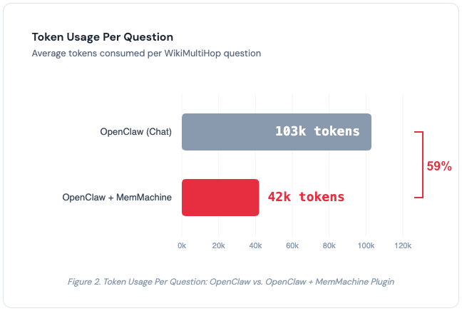
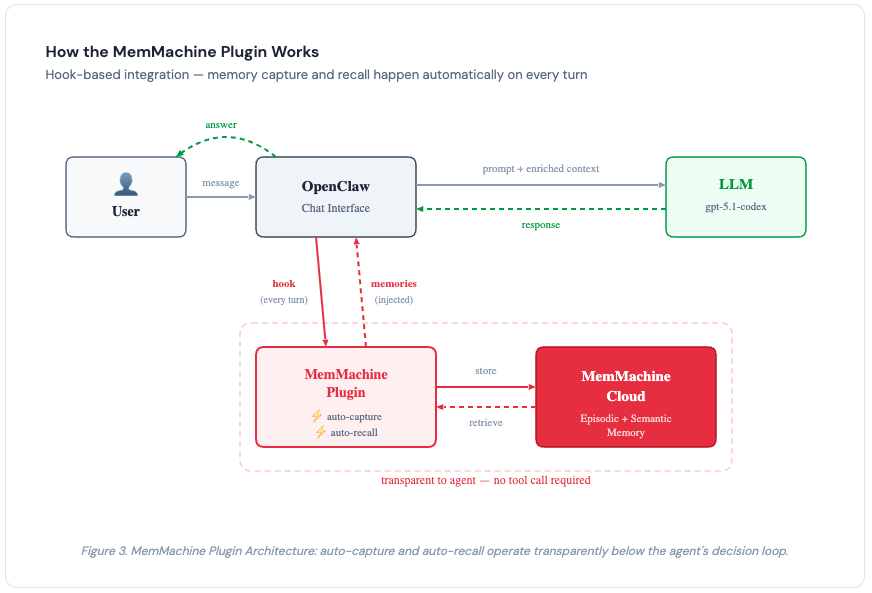

## Introduction

[OpenClaw](https://github.com/openclaw/openclaw) has become one of the fastest-growing open-source projects in recent memory. In just a few weeks, it went from a weekend side project to over 200K GitHub stars, a dedicated conference (ClawCon), and a thriving plugin ecosystem. It connects to WhatsApp, Telegram, Discord, Slack, iMessage, and more, giving you an always-on AI assistant across every messaging platform you use.

The community enthusiasm is well-deserved. OpenClaw makes it remarkably easy to run a personal AI agent. But as adoption grows, one persistent pain point keeps surfacing: **memory**.

OpenClaw's built-in memory is simple by design — plain Markdown files stored on disk, with a semantic search layer backed by SQLite embeddings. That simplicity is a feature for transparency and portability, but it becomes a limitation for the kinds of complex queries that real-world usage demands.

We wanted to move beyond anecdotal complaints and quantify the problem. So we ran a controlled benchmark using [2WikiMultiHopQA](https://aclanthology.org/2020.coling-main.580/), an industry-standard multi-hop reasoning dataset, and compared vanilla OpenClaw against OpenClaw with the [MemMachine plugin](https://github.com/MemMachine/MemMachine). <!-- TODO: Update with actual plugin repo URL -->

## The Benchmark: 2WikiMultiHopQA

Before we get into the numbers, a quick word on why we chose this particular benchmark.

[2WikiMultiHopQA](https://aclanthology.org/2020.coling-main.580/) was created by Ho et al. and published at COLING 2020. It is one of the most widely cited benchmarks in the multi-hop question answering research community, alongside [HotpotQA](https://hotpotqa.github.io/) and [MuSiQue](https://arxiv.org/abs/2108.00573).

What makes multi-hop questions hard? They cannot be answered from a single document or a single memory lookup. Each question requires the system to retrieve separate pieces of evidence and logically connect them. Here are three real examples from our test run:

- **"Who is the mother of the director of film Polish-Russian War?"** — The system must first identify the director (Xawery Żuławski), then find his mother (Małgorzata Braunek). Two separate facts, two separate lookups, one answer.
- **"Which film came out first, Blind Shaft or The Mask Of Fu Manchu?"** — The system must retrieve the release dates for both films and compare them.
- **"When did John V, Prince of Anhalt-Zerbst's father die?"** — The system must identify the father, then find the death date.

This is the acid test for any memory system. Simple keyword matching and single-vector-similarity lookups break down when the answer lives at the intersection of two or more facts.

We ran 100 questions from the 2WikiMultiHopQA dataset. All answers were evaluated by gpt-5-mini as the judge model.

## The Test Setup

We designed two test configurations using the same model, the same chat interface, and the same 100 questions — the only variable is the memory system.

### OpenClaw (Vanilla Chat)

This test simulates what a real user experiences. A Python script sends all benchmark content through OpenClaw's chat window - the same way you'd send daily messages to your assistant. OpenClaw stores these conversations in a `jsonl` file. Then we send questions one by one through the chat window and capture the responses.

**Model:** openai/gpt-5.1-codex
**What it measures:** End-to-end OpenClaw performance — ingestion, storage, and answering — using the default chat workflow with no additional memory plugins.

### OpenClaw with MemMachine Plugin

Same chat workflow as above, but with the MemMachine plugin installed and configured with a [MemMachine Cloud](https://console.memmachine.ai) API key.

The plugin does two things automatically:
1. **Auto-capture** — Conversations in the OpenClaw chat window are ingested into MemMachine in real time.
2. **Auto-recall** — Before the agent answers any question, MemMachine is searched for relevant memories, and the context is injected into the prompt.

**Model:** openai/gpt-5.1-codex (same as vanilla)

**What it measures:** End-to-end OpenClaw performance with MemMachine providing the memory layer - same interface, same model, same questions, different memory system.

## Results

| | OpenClaw (Chat) | OpenClaw + MemMachine |
|---|---|---|
| **Model** | gpt-5.1-codex | gpt-5.1-codex |
| **Accuracy** | 36.8% | **81.1%** |
| **Tokens / Question** | 103k | **42k** |
| **Improvement** | — | **+44.3 pp (2.2×), −59% tokens** |

*Table 1. WikiMultiHop benchmark results — 100 questions from 2WikiMultiHopQA, evaluated by gpt-5-mini. Same model, same chat interface, same questions. The only variable is the memory system.*

*Figure 1. WikiMultiHop Answer Accuracy. MemMachine improves accuracy by +44.3 percentage points (2.2×) over vanilla OpenClaw.*

*Figure 2. Token usage per question. MemMachine reduces token consumption by 59% (103k → 42k) while more than doubling accuracy.*

## What the Numbers Mean

There are two key takeaways from these results.

### 1. MemMachine More Than Doubles Accuracy

With the same model (gpt-5.1-codex) and the same chat interface, adding the MemMachine plugin pushes accuracy from 36.8% to **81.1%** - a 2.2× improvement.

The 36.8% baseline tells us something important on its own. Without effective memory retrieval, OpenClaw is largely relying on the LLM's own parametric knowledge — facts it absorbed during training. For multi-hop questions, that's not enough. Searching for *"Who is the mother of the director of Polish-Russian War"* as a single vector query won't match documents about Xawery Żuławski's family — the entities and relationships are spread across multiple memory entries, and OpenClaw's embeddings-based search struggles to connect them.

MemMachine's multi-layered memory architecture, combining [episodic and semantic memory types](https://memmachine.ai/blog/2026/02/integrating-memmachine-into-your-ai-agents/), surfaces the relevant facts across multiple hops so the LLM can do what it does best. The jump to 81.1% proves the LLM is perfectly capable of answering these questions - it just needs the right context.

The bottleneck was never the reasoning. It was the retrieval.

### 2. Better Accuracy at Lower Cost

This is the result we didn't expect. Typically, better accuracy comes at the cost of more tokens - you feed the model more context, it produces better answers, and your API bill goes up.

MemMachine flips that trade-off. Token usage dropped from **103k to 42k per question** — a **59% reduction**.

Why? Vanilla OpenClaw loads large chunks of chat history into the context window indiscriminately. MemMachine retrieves only the memories relevant to the current question. Less noise, more signal. The model spends fewer tokens processing irrelevant context and more tokens reasoning over the facts that matter.

For teams running thousands of queries, the cost savings add up quickly.

## How the MemMachine Plugin Works

The MemMachine plugin for OpenClaw integrates at the hook level rather than the tool level. This is an important distinction.

With OpenClaw's default memory, the agent must *choose* to call `memory_search` as a tool — and it doesn't always make that choice. With hook-based integration, memory capture and recall happen automatically on every turn, regardless of what the agent decides to do. The memory layer operates transparently below the agent's decision loop.

The plugin connects to the [MemMachine Cloud Platform](https://console.memmachine.ai) via an API key. Setup takes minutes - generate a key from the console, add it to your plugin configuration, and you're done.

Under the hood, MemMachine organizes memories into [episodic memory](https://memmachine.ai/blog/2026/02/integrating-memmachine-into-your-ai-agents/#1-episodic-memory) (capturing the narrative and temporal flow of conversations) and [semantic memory](https://memmachine.ai/blog/2026/02/integrating-memmachine-into-your-ai-agents/#2-semantic-memory-profile-memory) (extracting durable facts and preferences). This dual-memory architecture enables the kind of structured retrieval that simple vector search over flat Markdown files cannot provide.

*Figure 3. MemMachine Plugin Architecture: auto-capture and auto-recall operate transparently below the agent's decision loop via hooks - no tool call required.*

## A Note on Test Methodology

Transparency matters, so a few notes on the test setup:

- **Both tests used the same model** (gpt-5.1-codex), the same chat interface, and the same 100 questions. The only variable is the memory system. This is an apples-to-apples comparison.
- **We tested 100 questions from the WikiMultiHop dataset.** During our evaluation, we encountered issues running the full suite of benchmarks (LoCoMo, the full WikiMultiHop set, and HotpotQA) end-to-end through OpenClaw's chat interface. We focused on WikiMultiHop because multi-hop reasoning is the most demanding test of memory retrieval quality - if the memory system can't handle compositional queries, it will struggle with everything else too.
- **All answers were evaluated by gpt-5-mini** as the judge model.

## Getting Started

The MemMachine plugin for OpenClaw is available today. 

1. **Sign up for MemMachine Cloud** — Create an account and generate an API key at [console.memmachine.ai](https://console.memmachine.ai).
2. **Install the OpenClaw Plugin** — `openclaw plugins install @memmachine/openclaw-memmachine`
3. **Configure** — Add your MemMachine API key to the plugin configuration.
4. **Use OpenClaw normally** — The plugin handles capture and recall automatically. No workflow changes needed.

## Conclusion

OpenClaw is building something genuinely useful - an open, extensible AI assistant that meets you on whatever platform you prefer. The plugin ecosystem is proof that the community sees its potential and is actively working to improve it.

Memory is the piece that needed the most work, and the benchmark data confirms what many in the community have felt: OpenClaw's default memory struggles with anything beyond simple lookups. On 2WikiMultiHopQA, vanilla OpenClaw achieved just 36.8% accuracy — most of that coming from the LLM's own training data, not retrieved memories.

MemMachine changes that equation. With the same model and the same interface, accuracy jumps from 36.8% to 81.1%, while token usage drops from 103k to 42k per question. The LLM was always capable — it just needed the right memories at the right time.

If you're running OpenClaw and want memory that keeps up with the questions you're actually asking, give MemMachine a try. See the source code on [GitHub](https://github.com/memmachine/memmachine), leave a Star, and ask questions in our [Discord Server](https://discord.gg/usydANvKqD).

