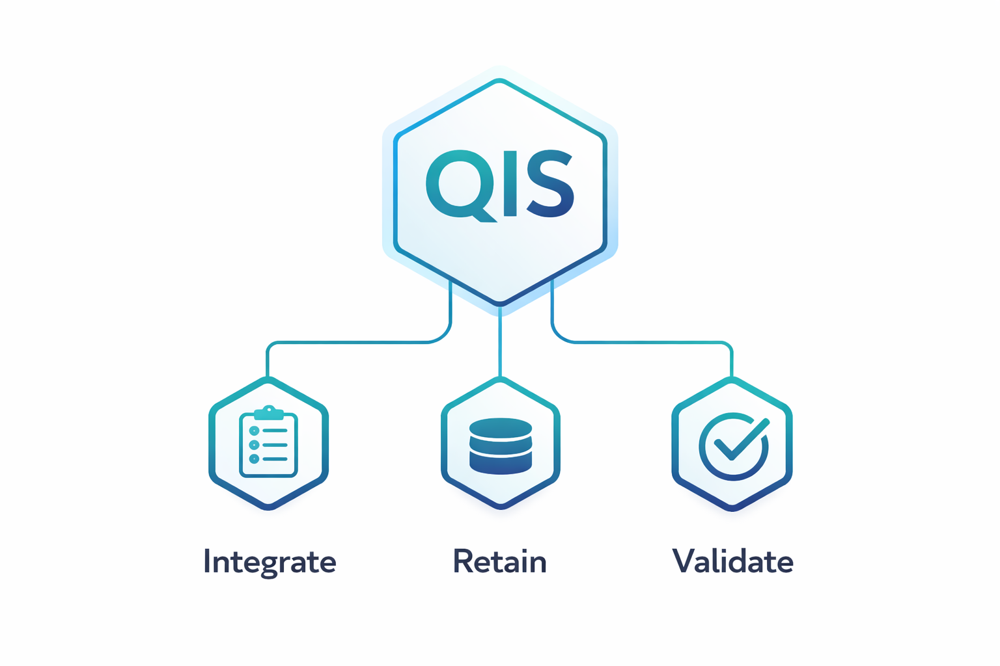
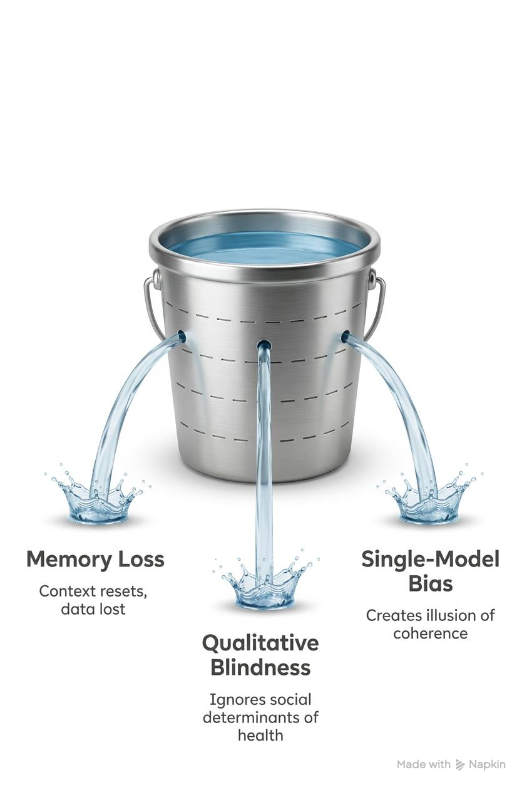
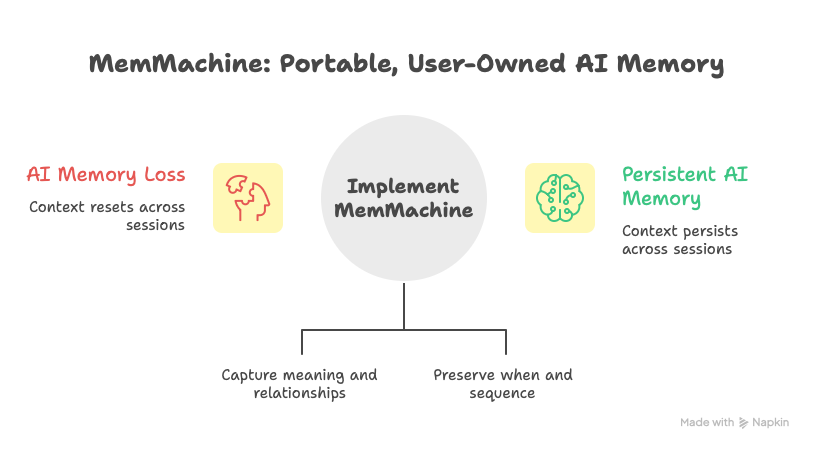

## The Clinical Trial Problem

Written by: Marc Bulandr, Jonathan Jiang

Ninety percent of drug trials fail.

For every ten compounds that make it into human testing, nine are abandoned after the industry has burned through an average of $2.6 billion per eventual approval. The human cost runs deeper than the economics. Patients with rare diseases wait years for treatments that never arrive. Families watch their loved ones decline with nothing to offer but hope and time, and both run out.

Biology explains part of that number. Drug targets are elusive. Disease mechanisms are poorly understood. Patient populations vary in ways that confound even the most carefully designed studies. All true. But biology alone does not account for a 90 percent failure rate.

A structural failure sits underneath the biological one, hiding in plain sight for decades. Clinical trials are engineered to capture what can be counted and discard everything else.

Every trial collects quantitative data with extraordinary rigor. Forced vital capacity scores. Six-minute walk distances. Biomarker panels. Imaging sequences. Standardized, reproducible, defensible. And incomplete.

What these metrics miss is why a patient whose numbers looked stable at Month 3 dropped out at Month 5. Why two patients with nearly identical spirometry results had radically different outcomes by Month 9. Why did the caregiver who drove sixty miles each way to every appointment stop coming?

In pulmonary fibrosis, this gap plays out in every trial in the interstitial lung disease pipeline. A patient sits in a clinic and reports that the medication is fine. What they leave unsaid is that they have stopped carrying groceries from the car because the walk from the driveway leaves them breathless. That they canceled plans with friends because they cannot predict how they will feel from hour to hour. That their spouse is quietly terrified and has not told anyone.

Those are the earliest indicators of decline, adherence failure, and dropout. They precede the quantitative evidence by weeks or months. And they are systematically lost because no architecture exists to capture, retain, and integrate them alongside the numbers.

The qualitative data that explains why the numbers move, the social determinants of health, the patient narratives, the caregiver observations, the lived texture of disease, gets discussed in clinic rooms, shared in patient communities, and noted in passing during follow-ups. Then lost.

**The hypothesis is direct.** If qualitative signals were captured and retained as active data from the earliest phases of a trial, the course corrections that currently arrive too late could happen when they still matter. Not every failed trial would be saved. But even a modest improvement in success rates would transform the economics of drug development and, far more importantly, change patients' lives.

Patients generate this data every day. Caregivers carry it home every night.

**The question is whether we finally build the intelligence architecture that refuses to throw it away.**

## The Methodology: QIS

### Qualitative Intelligence Systems

Better analytics got us this far. They will not get us the rest of the way. Closing the qualitative gap requires a framework designed to integrate, retain, and validate the full spectrum of patient data before conclusions harden into billion-dollar outcomes.

Qualitative Intelligence Systems, or QIS, is a patent-pending methodology built for exactly this. It rests on three pillars.

**First: Qualitative and quantitative integration.** QIS treats qualitative data with the same rigor as clinical metrics. Patient narratives, caregiver observations, social determinants of health, and environmental context are ingested alongside quantitative measures and tagged with sociological metadata: when it happened, who reported it, the relational context, and the situational dependency. A caregiver's observation about increasing breathlessness between visits becomes a tagged, structured signal sitting alongside the forced vital capacity score recorded the same week. Both enter the same analytical foundation.

A patient wears a fitness tracker that logs resting pulse rate throughout the day. Those readings are stored as episodic memory, time-stamped events that capture what happened and when. Meanwhile, the patient mentions to a nurse during a telehealth check-in that she has been feeling more winded in the mornings and has started skipping her daily walk. QIS tags that narrative with sociological metadata and stores it as semantic memory, capturing what the observation means in the context of her treatment journey. When a weekly efficacy report runs, both data sources inform the analysis. The pulse rate trend and the patient's own words converge, surfacing a signal of possible decline weeks before the next scheduled spirometry test.

**Second: Persistent memory.** This is where QIS diverges from every retrieval-augmented system on the market. Traditional AI systems search for context when prompted. They reduce everything to embeddings and pull back whatever looks statistically similar. A patient's story from Month 1 carries different clinical weight at Month 6, but those systems cannot make that distinction. QIS maintains persistent qualitative memory: retained longitudinal context that stays structurally present across every analysis. What a patient said about fatigue in January remains an active signal in July.

**Third: Recursive multi-model triangulation with human iteration gates.** Every AI model carries architectural bias and training limitations. QIS deploys multiple independent models against the same integrated data, maps where they converge and where they diverge, and requires human review at every conclusion point before any finding is adopted. Where models agree under different analytical lenses, the finding is robust. Where they disagree, that gap becomes the focus of deeper inquiry. The human gate ensures no conclusion passes into the decision chain without expert validation.

The output is *Verstehen*: the difference between knowing a patient's lung function score dropped and understanding that they stopped taking the medication because the copay increase meant choosing between the prescription and groceries.

QIS exists as methodology today, by deliberate choice. Marc Bulandr has spent 34 years in enterprise technology, from SPSS to IBM to Verizon, watching organizations build systems that measure what is easy to count and discard everything that explains why the numbers move. He built QIS because he got tired of watching it happen. The framework has been validated across multiple domains using the same recursive triangulation process that produced this blog post.

The offer is simple: bring your data and the insights you think you have. Keep the scope small. QIS will surface the gaps, the missing signals, and the conclusions your current tools cannot reach. Three decades of enterprise technology taught Bulandr when something works and when it does not. That is precisely why he is here and doing this now.

The methodology is ready. What it needs is memory infrastructure that can hold qualitative context over time, across models, at scale. That infrastructure already exists.

## AI's Three Compounding Failures

To understand why that new infrastructure matters, look at what happens without it. Today's AI systems suffer from three compounding failures that prevent true clinical intelligence. All three trace back to design choices, and all three have engineering solutions.

**Failure One: Memory Loss**

Most AI interactions are session-bound. Context resets. What a patient disclosed three months ago disappears unless someone manually reintroduces it.

A pulmonary fibrosis patient tells a research coordinator in January that she has been waking at 3 a.m., unable to breathe. That her husband has started sleeping in the guest room because he is afraid of what he might hear. That she has stopped telling her daughter how bad it has gotten because she does not want to be a burden. By April, the AI system processing her trial data has no knowledge that any of those conversations happened. The quantitative record shows stable forced vital capacity. The qualitative record simply does not exist.

Traditional vector search compounds this problem. It reduces rich narratives to static embeddings, stripping away nuance, temporal relevance, and the context that gives data meaning. A three-month-old disclosure about waking up breathless and a three-day-old lab value are treated as equivalent inputs. The system cannot tell a trajectory from a data point.

**Failure Two: Qualitative Blindness**

AI systems are optimized for structured inputs. Pulmonary function tests, imaging results, and dosage levels. These fit neatly into models. But the factors that explain why outcomes diverge rarely get integrated with the same rigor.

The caregiver who quietly mentions, "He is skipping doses because the copay just went up again." The patient who says, "I stopped the trial drug because the fatigue feels different this time." Patients in underserved areas who struggle to maintain the required diet. These signals, the social determinants of health, the subtle shifts in daily function, the cultural barriers to adherence, never make it into the model.

In rare disease, this blindness is especially damaging. When patient populations are too small for statistical significance, the qualitative layer may be the only meaningful signal available. Discarding it means discarding the best chance at insight.

**Failure Three: Single-Model Bias**

Relying on one AI model creates an illusion of coherence. The output sounds confident, even elegant. But internal consistency and validation are two different things.

A single model might confidently flag a patient as stable based on quantitative trends while missing the qualitative signals that would have triggered an early protocol change. The system has no awareness of its own blind spots. Without cross-model triangulation and structured human review, AI produces what looks like understanding but is actually fluency mistaken for rigor.

**All three are engineering problems with engineering solutions.**
***And the first one, memory, is already being solved.***

## The Memory Foundation: MemMachine

The patient who told us everything in January, the one the AI forgot by April, needs a memory system built for the complexity of her actual life. Most AI memory systems were never designed for that.

MemMachine takes a different approach. It combines semantic and episodic memory stores to maintain both the meaning and the timeline of interactions. This dual-layer architecture enables portable, user-owned memory that works across any AI model, delivering measurable results: 92.5 percent accuracy on LoCoMo (Long-Term Conversational Memory), the highest benchmark score in the industry for long-context memory retrieval.

### How Semantic and Episodic Memory Work Together

Traditional vector search reduces everything to static embeddings, losing the weight of a caregiver's concern, the significance of a social determinant, and the temporal context that matters in clinical decision-making. A patient's story from three months ago carries different clinical relevance than yesterday's lab results, but vector search treats them the same.

MemMachine's dual-store architecture addresses this directly. The semantic layer captures meaning and relationships across the entire knowledge base. The episodic layer preserves the when and the sequence: which consultation happened first, what changed over time, and how the patient's condition evolved. Together, they enable retrieval based on actual clinical relevance.

### Real Workflow Applications

In the patient synthesis workflow, this has an immediate impact. When aggregating data from multiple sources, electronic health records, research papers, and patient interviews, MemMachine ensures that:

- **Context persists across sessions.** Pick up exactly where you left off, even days later.
- **Cross-model validation works.** Switch between Claude for analysis and GPT for differential diagnosis without losing accumulated context.
- **Temporal relationships are preserved.** Understand how symptoms progressed, which interventions were tried when, and what the outcome timeline looked like.
- **Human oversight is enabled.** Clinician review and annotations become part of the memory, creating an auditable trail.

Because memory is portable and user-owned, the context that has been built, patient histories, clinical insights, and research connections, travels with the user as models evolve.

## What Comes Next

For decades, we lacked the infrastructure to capture what patients were telling us. Today, the technology to do so finally exists.

Clinical research does not lack data. It lacks memory and meaning.

Methodology alone needs infrastructure to scale. Without persistent memory, qualitative insights remain transient observations that disappear between analyses. MemMachine provides the infrastructure needed to retain that context, combining semantic meaning with episodic timelines so that qualitative signals remain part of the analytical foundation over time.

Together, QIS and MemMachine enable clinical research to move from isolated measurements to genuine understanding.

Some trials will still fail, but when the signals patients generate every day are captured, remembered, and integrated into analysis, the probability of insight changes, and with it, the potential to improve outcomes for the patients waiting for answers.

This blog was developed using the QIS methodology, which it describes: six independent AI models, recursive triangulation, and human judgment at every gate.

---

### Collaborate on QIS

For clinical leaders, researchers, and trial sponsors: Qualitative Intelligence Systems is a patent-pending methodology for integrating qualitative and quantitative intelligence in clinical research.

**Marc Bulandr** — [mbulandr@gmail.com](mailto:mbulandr@gmail.com) | [linkedin.com/in/marcbulandr](https://linkedin.com/in/marcbulandr)

### Explore MemMachine

For teams evaluating persistent memory infrastructure: Learn more or experiment with MemMachine's persistent AI memory infrastructure.

**Jonathan Jiang** — [jon.jiang@memverge.com](mailto:jon.jiang@memverge.com) | [linkedin.com/in/jiang](https://linkedin.com/in/jiang)
